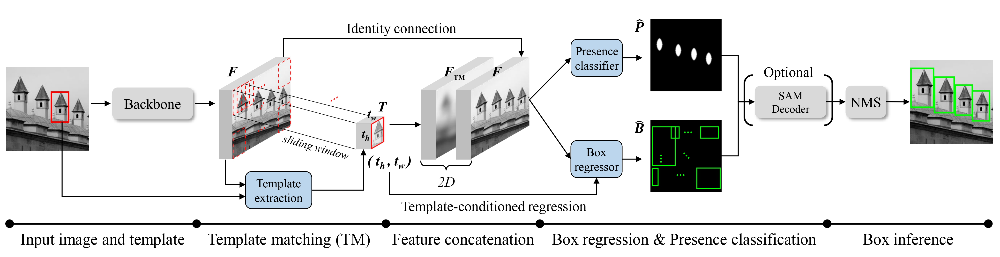

# Few-Shot Pattern Detection via Template Matching and Regression (ICCV25 Highlight)

**Eunchan Jo**,
[**Dahyun Kang**](https://dahyun-kang.github.io),
[**Sanghyun Kim**](https://oreochocolate.github.io/),
**Yunseon Choi**,
[**Minsu Cho**](https://cvlab.postech.ac.kr/~mcho/)

Official implementation of "Few-Shot Pattern Detection via Template Matching and Regression", ✨ ICCV 2025 (Highlight) ✨

</div>

## Overview

<p align="center">
    
</p>

>**Abstract**: <br>
> We address the problem of few-shot pattern detection, which aims to detect all instances of a given pattern, typically represented by a few exemplars, from an input image. Although similar problems have been studied in few-shot object counting and detection (FSCD), previous methods and their benchmarks have narrowed patterns of interest to object categories and often fail to localize non-object patterns. In this work, we propose a simple yet effective detector based on template matching and regression, dubbed TMR. While previous FSCD methods typically represent target exemplars as spatially collapsed prototypes and lose structural information, we revisit classic template matching and regression. It effectively preserves and leverages the spatial layout of exemplars through a minimalistic structure with a small number of learnable convolutional or projection layers on top of a frozen backbone. We also introduce a new dataset, dubbed RPINE, which covers a wider range of patterns than existing object-centric datasets. Our method outperforms the state-of-the-art methods on the three benchmarks, RPINE, FSCD-147, and FSCD-LVIS, and demonstrates strong generalization in cross-dataset evaluation.

## Code coming soon

## Citation

If you find this work useful for your research, please cite our paper:

```bibtex
@inproceedings{jo2025tmr,
  title     = {Few-Shot Pattern Detection via Template Matching and Regression},
  author    = {Eunchan Jo, Dahyun Kang, Sanghyun Kim, Yunseon Choi, and Minsu Cho},
  booktitle = {International Conference on Computer Vision (ICCV)},
  year      = {2025},
}
```